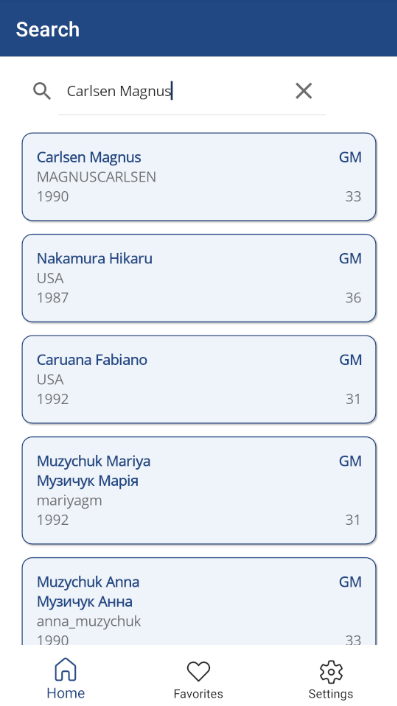
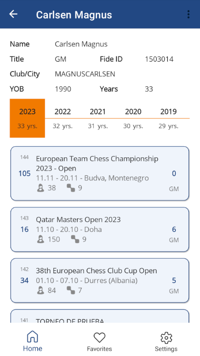

## About
The "Chess Player" is a simple mobile/desktop application developed using the .NET MAUI framework to retrieve information about a chess player and his tournament history. It provides insight into a chess player by showing important details such as club affiliation, city, title and class. Whether you're interested in a local chess talent or a famous player, this app offers a rich repository of profiles.

Dive deep into players' past performances, unraveling their strategies, successes and challenges in various chess competitions. Download Chess Player now to explore the details of the tournament journeys of chess players!

## Screnshots

## Download
Android [Google Play](https://play.google.com/store/apps/details?id=com.chess.player)
